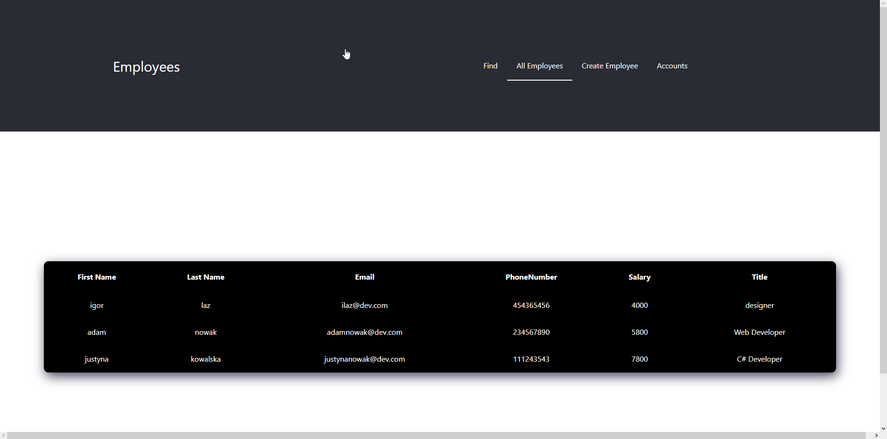

# Employee
CRUD app made in MERN - mongo, express.js, react.js, node.js theme.



If you want run this app on your computer/serwer first you had to install mongodb on your device ([Download here!](https://www.mongodb.com/docs/manual/installation/)). Second node.js with npm manager is necessary for running this app ([Download here!](https://nodejs.org/en))

---
## Run app

### Start backend
```cmd
cd /backend
npm install
```
Next you must create ```.env``` file in bckend directory. File should look like this

```cmd
MONGODB_URI = mongodb://127.0.0.1:27017/<Name_Your_Schema>
PORT = <Port which app listen on running>
```
Finally, you can start backed with command:
```
npm run devWatch
```

### Start frontend
```cmd
cd ..
cd /frontend
npm install
npm run start
```

---
## Packages

List of all packages and libraries which you have installed you can find in:

1. Backend - [Here](./backend/package.json)
2. Frontend - [Here](./frontend/package.json)

Below you can see all packages which I've installed.

## Logs 

You can read all of application's logs in ```log.log``` file [here](./backend/log.log)
Logs are generated by scripts using **winston** library

## Database Schema

Exported collection from schema is [here](./backend/employees.json) in json file. You can import this in mongodb compass, but it is not necessary for running if you created empty schema you can insert data into database in app.

## Bugs

If you got an error and blank page check if you opened backend adress in frontend proxy.

Go to ```./frontend/package.json```
And add on the top of file
```json
"proxy": "http://localhost:<Port_which_is_using_in_backend>",
```

